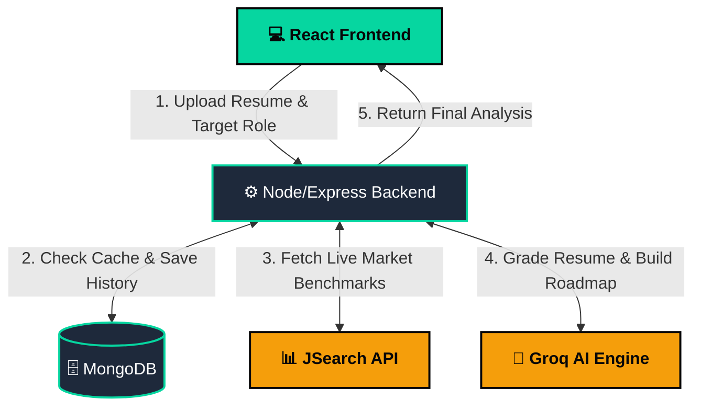
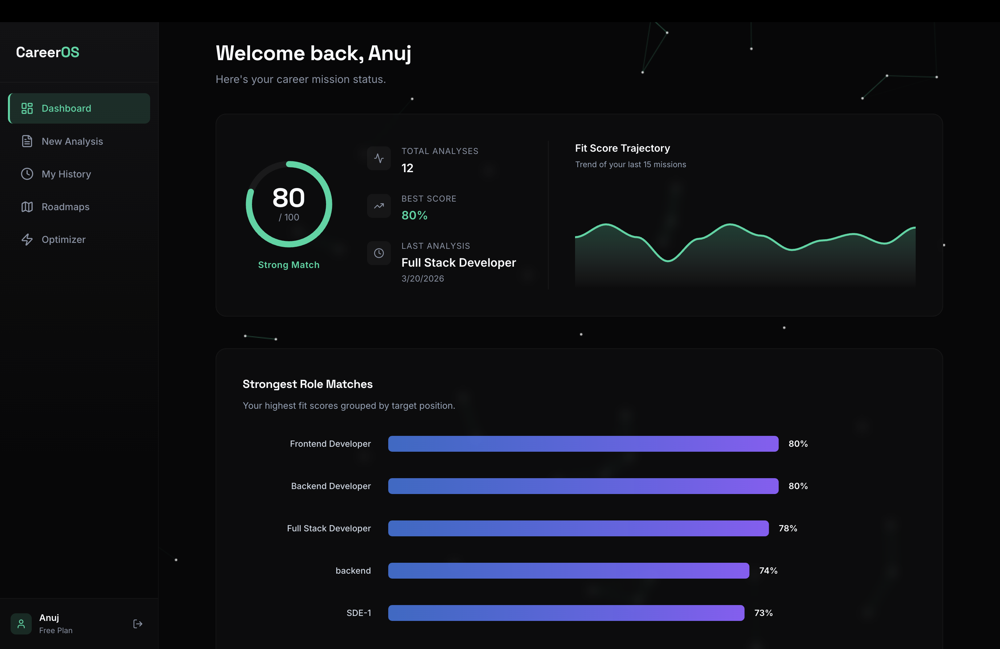
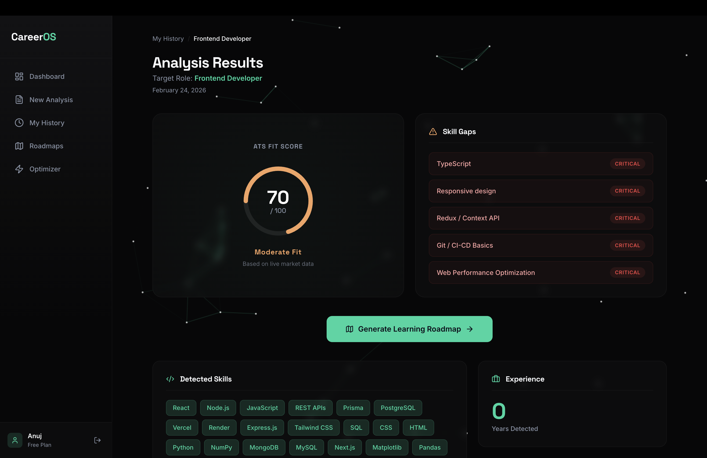
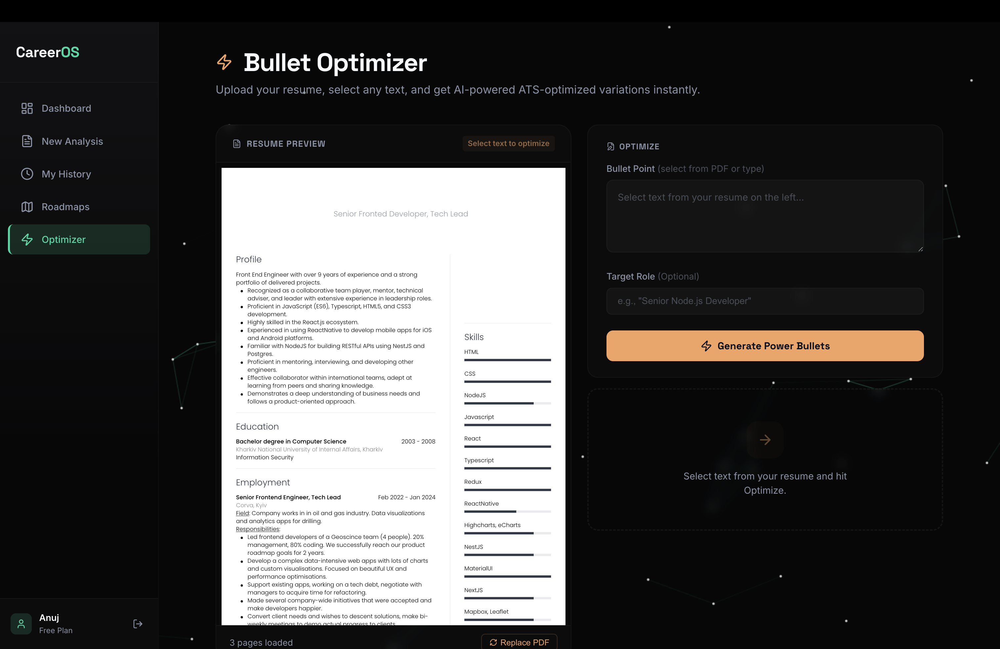

# 🚀 CareerOS: AI-Powered Resume & Market Intelligence Platform

[](https://reactjs.org/)
[](https://nodejs.org/)
[](https://mongodb.com/)
[](https://groq.com/)

---
> **Stop guessing. Know your market fit.** CareerOS goes beyond "dumb" keyword matching by dynamically fetching live job descriptions, building a real-time statistical benchmark, and using LLMs to score your resume, identify critical skill gaps, and generate actionable learning roadmaps.

---

## 🌐 Live Demo
👉 Experience the live project here: https://career-os-topaz.vercel.app/

## 🎯 Why CareerOS?

Most ATS tools rely on static keyword matching. CareerOS solves this by:
- Using live job market data
- Applying contextual AI scoring
- Providing actionable improvement paths

## ⚡ Highlights

- Real-time job market benchmarking (JSearch API)
- AI-powered ATS scoring (LLMs)
- Personalized learning roadmap generator
- Resume bullet optimizer (anti-hallucination AI)

## ✨ Core Features

* 🧠 **Smart AI Resume Parsing:** Extracts not just skills, but years of experience, project stacks, and contextual history from PDFs using AI—handling varied formats seamlessly.
* 📊 **Real-Time Market Benchmarking:** Integrates with the JSearch API to fetch live Job Descriptions (JDs) for your target role. It averages skill frequencies over time to create a highly accurate, constantly evolving "Answer Key" for the current job market.
* 🎯 **Contextual ATS Scoring:** Evaluates your resume against the live benchmark using a strict 100-point rubric. It understands "Stack Equivalency" (e.g., not heavily penalizing a Python dev applying for a Node.js role) unlike traditional ATS systems.
* 🗺️ **Dynamic Learning Roadmaps:** Generates a custom, week-by-week flight plan to bridge your specific missing skills, complete with optimized search queries for self-study.
* ⚡ **Anti-Hallucination Bullet Optimizer:** Employs the "XYZ Formula" to rewrite weak resume points. It silently feeds your *actual* extracted skills into the AI context window, completely eliminating AI hallucinations and fake metrics.
* 💾 **Deterministic Hashing Cache:** Uses Node.js `crypto` (SHA-256) to fingerprint resume text + target roles, resulting in instant cache-hits for identical queries and saving massive API overhead.

---

## 🛠️ Architecture & Tech Stack

### Frontend
* **Framework:** React 18 + Vite
* **Routing:** React Router DOM (Protected routing with JWT verification)
* **State & Data:** React Hooks + Axios interceptors
* **UI/UX:** Custom CSS (Deep Ink & Teal aesthetic), Framer Motion (page transitions, micro-interactions), Lucide React (icons)
* **Visualizations:** Recharts & ApexCharts (Sparklines, Score Rings, Dashboards)
* **PDF Handling:** `react-pdf` with interactive text-selection hooks

### Backend
* **Runtime/Server:** Node.js + Express.js
* **Database:** MongoDB + Mongoose ORM
* **AI Engine:** Groq SDK (Utilizing open-source LLMs like Llama-3/Mixtral for lightning-fast inference)
* **Market Data:** RapidAPI (JSearch API)
* **Security & Auth:** `bcrypt` (password hashing), `jsonwebtoken` (session management)
* **Performance:** `crypto` deterministic hashing for AI response memoization

---

## 📂 Project Structure

A clean, modular monorepo structure separating the React frontend and Express backend.

```text
career-os/
├── backend/                  
│   ├── src/
│   │   ├── analysis/         # AI PDF parsing & Groq structured data extraction
│   │   ├── auth/             # JWT Authentication, routes, and bcrypt logic
│   │   ├── benchmarks/       # JSearch API fetchers, caching & market averaging
│   │   ├── career/           # Fit score generation & rubric logic
│   │   ├── config/           # MongoDB connection setup
│   │   ├── middlewares/      # Multer memory storage for PDF uploads
│   │   ├── models/           # Mongoose schemas (User, ResumeAnalysis, etc.)
│   │   ├── optimizer/        # AI bullet point rewriting & XYZ formula logic
│   │   ├── pdf/              # pdf-parse text extraction
│   │   ├── roadmap/          # AI dynamic learning path generator
│   │   └── app.js            # Express entry point & global error handling
│   ├── .env                  
│   └── package.json          
│
├── frontend/                 
│   ├── src/
│   │   ├── assets/           # Local SVG icons and static assets
│   │   ├── components/       # Reusable UI (NetworkBackground, ScoreCard, Loaders)
│   │   ├── pages/            # Core Views (Dashboard, Analysis, Optimizer, etc.)
│   │   ├── styles/           # Custom CSS (Deep Ink & Teal aesthetic)
│   │   ├── api.js            # Axios instance with JWT auth interceptors
│   │   ├── App.jsx           # Main React Router setup & protected routes
│   │   └── main.jsx          # React DOM rendering
│   ├── index.html            
│   └── package.json          
│
└── README.md
```



## 💡 Engineering Highlights

### 1. The "Smart Benchmark" Aggregator
Instead of relying on a static JSON file of "Frontend Skills", CareerOS fetches 10 real JDs per request. A dedicated background service mathematically averages the newly discovered skills with historical database entries. This means the platform automatically adapts to industry shifts (e.g., if the market shifts from React to Vue, the app adjusts its scoring weights without a single code update).

### 2. Guardrailed AI Generation
LLMs are notorious for returning inconsistent JSON or hallucinating fake metrics. CareerOS utilizes:
* **Temperature Control:** `0.0` for rigid scoring, `0.1` for anti-hallucination bullet rewriting, and `0.3` for roadmap generation.
* **Context Injection:** The Bullet Optimizer pulls the user's previously extracted skills from MongoDB and forces the AI to *only* use those tools, preventing it from inventing fake frameworks on the user's resume.

---

## 📸 Platform Sneak Peek

### 1. Interactive Dashboard
*Displays overall trajectory, highest scores, and recent mission logs using ApexCharts.*


### 2. In-Depth Analysis & Scoring
*Shows the ATS Gauge, Critical Skill Gaps, and Extracted Data.*


### 3. AI Bullet Optimizer
*The side-by-side PDF viewer and XYZ-formula bullet generator.*


---

## ⚙️ Local Setup & Installation

### Prerequisites
* Node.js (v18+ recommended)
* MongoDB instance (Local or Atlas)
* [Groq API Key](https://console.groq.com/) (Free)
* [RapidAPI Key (JSearch)](https://rapidapi.com/letscrape-6bRBa3QG1q/api/jsearch) (Free Tier)

### 1. Clone the repository
```bash
git clone https://github.com/Anuj-Chhajed/CareerOS.git
cd CareerOS
```

### 2. Backend Setup
```bash
cd backend
npm install
```

#### Create a .env file in the /backend directory:
```env
PORT=4000
MONGO_URI=your_mongodb_connection_string
JWT_SECRET=your_super_secret_jwt_key
GROQ_API_KEY=your_groq_api_key
RAPID_API_KEY=your_rapidapi_jsearch_key
```

#### Start the backend server:
```bash
npm run dev
```

### 3. Frontend Setup
#### Open a new terminal window:
```bash
cd frontend
npm install
```

#### Start the frontend development server:
```bash
npm run dev
```

## 🚀 How to Use

1. **Create an Account:** Sign up securely using JWT authentication.
2. **Upload Resume:** Navigate to "New Analysis" and drop your PDF. Watch the AI stream its parsing process.
3. **Target a Role:** Enter the exact job title you want (e.g., "Full Stack Developer").
4. **Review Results:** See your Market Fit Score out of 100, view critically missing skills, and see how your experience stacks up against the live market benchmark.
5. **Generate Roadmap:** Click "Generate Learning Roadmap" to get a 4-6 week plan customized to teach you *only* the skills you are missing.
6. **Optimize Bullets:** Head to the Bullet Optimizer, highlight weak text from your parsed PDF, and let the AI rewrite it using the XYZ impact formula based on your actual known skills.

## 🔮 Future Roadmap

- [ ] **Direct Job Matching:** One-click links to actual job postings that match your current fit score.
- [ ] **Curated Video Learning:** Automatically fetch and embed top-rated YouTube crash courses and tutorials directly into the generated weekly learning roadmaps.
- [ ] **Interview Simulator:** A chatbot that asks technical questions based strictly on the user's identified skill gaps.

## 👨‍💻 Author

**Anuj Chhajed**

- GitHub: https://github.com/Anuj-Chhajed
- LinkedIn: https://www.linkedin.com/in/anuj-chhajed-33a61734a/

### 🧠 Designed and engineered by **Anuj Chhajed**. Built for the modern job market.


